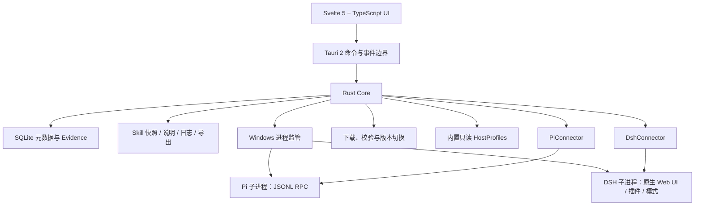

# Aster 产品与架构基线

状态：M3 完成基线（2026-08-16 更新：M3 Skills Manager 广度完成，11 宿主 Profiles、多 Skill 仓库解析、快照 Diff、中文说明、安全隔离与批量部署补偿回滚，命令见 README，决策见 `docs/adr/ADR-0004`）  
日期：2026-08-16  
正式支持平台：Windows 10 22H2 / Windows 11 x64  
产品阶段：M3 Skills Manager 广度完成（见第 14 节退出标准与仓库 README）

本文是 Aster 当前的产品、架构与交付事实源。它描述“要构建什么、责任在哪里、怎样证明完成”，不冻结具体 Rust trait、SQLite 表、Svelte 组件或目录结构。高代价技术偏离应写 ADR，并同步更新本文。

## 1. 一句话定义

Aster 是面向熟悉 AI 工具的开发者和高级用户的 Windows 本地优先桌面工作台：用户可以在同一应用中分别使用 Pi 或 DeepSeek Harness（DSH），管理工作目录与跨工具 Skills，观察工具执行，管理宿主版本，并恢复可追踪的本地工作状态。

它类似 coding-agent 工作台，但 Alpha 不是代码 IDE，不尝试把两个 harness 伪装成同一种 Agent。

## 2. 目标用户与价值

目标用户是已经使用一个或多个 coding agent、能理解工作目录与 GitHub 来源、希望减少多工具切换和 Skill 目录混乱的个人开发者或小范围同学。

Aster 提供四项核心价值：

1. 一个本地窗口管理 Pi、DSH 与最近工作目录，但保留各宿主原生能力。
2. 看见进程、事件、工具调用和失败，而不是只有聊天输出。
3. 把分散的 Skills 变成有来源、有快照、有中文说明、有部署所有权、有兼容证据的资产。
4. 在用户确认下检查、安装和升级 Aster、Pi、DSH，并提供符合真实边界的恢复能力。

## 3. 产品原则

### 本地优先

- 无 Aster 账号。
- 无默认遥测或崩溃上传。
- 工作区、会话索引、Skill 快照与日志默认只在本机。
- 联网只用于用户触发或已知用途：上游更新检查、GitHub 来源访问、宿主自身网络行为。

### 忠实保留宿主

- Pi 与 DSH 是两种产品形态，不共用对话状态、工具模型或自定义能力。
- Aster 提供管理和可观察性，不替代宿主判断或重做其特色。
- 不支持的新版本以降级和“未验证”表达，不假装兼容。

### 证据优先

- “发现文件”“完成部署”“宿主已加载”“真实可调用”是不同状态。
- 所有兼容与恢复声明必须带版本、作用域和可重复证据。
- 未知是正常状态，不用推测填补。

### 用户控制写操作

- 不静默安装或更新。
- 不覆盖未托管目录。
- 不执行下载的 Skill 脚本或二进制。
- 高风险变化在执行前展示来源、目标、差异与恢复边界。

## 4. Alpha 范围

### 必须包含

- 可用的 Svelte 5 + TypeScript、Tauri 2、Rust Core、SQLite 桌面应用。
- Pi 与 DSH 独立入口、状态、安装、启动、停止、升级和受限回滚。
- Pi 的最小 RPC 会话、流式事件、工具执行观察、取消/异常恢复。
- DSH 原生 Web UI 的安全承载，保留其插件、自定义模式和自身持久化。
- 工作目录选择、最近项目和每个宿主独立的工作上下文。
- Skills 来源扫描、仓库分组、下载、不可变快照、静态检查、中文 Markdown 说明、更新、部署、差异与回滚。
- 目标工具分类：Cursor、Pi、DSH、Zcode、Grok Build、Qoder、Codex、Claude Code、Zed、Kimi Code、Antigravity。
- Pi/DSH 深层 evidence；其他工具文件级发现、部署和静态 evidence。
- Aster/Pi/DSH 独立更新检查；Aster-managed Pi/DSH 并排程序版本。
- 本地日志、可预览脱敏诊断包、非敏感数据导入/导出。
- 数据库迁移、进程、Pi RPC fixture、Skill 部署/补偿回滚和关键 Windows 文件场景测试。

### 明确不做

- 完整代码 IDE、语言服务器、调试器、Git 客户端或终端替代品。
- Pi 与 DSH 的统一接口、统一对话流或统一插件模型。
- Aster 账号、云同步、多人协作或模型/API 凭据管理。
- Aster 通用沙箱。Pi 的默认权限状态要如实显示；DSH 保留自身能力与边界。
- 执行 Skill 脚本、自动修改上游 Skill、自动提交或发布中文翻译。
- 第三方可执行 connector、远程动态运行规则或插件市场。
- macOS、Linux、Windows ARM64、portable mode。
- 全量视觉打磨和所有目标工具的深运行时验证。

## 5. 系统边界

### Svelte/Tauri 边界

UI 展示状态、接收明确用户意图，不直接操作任意文件或子进程。Tauri command/event 只暴露领域动作与稳定 DTO；路径、下载、解压、校验、安装、进程和数据库写入在 Rust 内完成。

长任务通过事件/查询返回阶段状态，不能让窗口线程等待。取消是领域动作，必须区分“请求取消”“宿主确认取消”“进程被终止”。

### Rust Core

Rust Core 至少承担以下责任，具体模块名可以调整：

- App data 与 Windows 路径安全；
- SQLite 连接、迁移和事务；
- 进程启动、健康检查、输出捕获、取消、停止、崩溃恢复；
- Pi RPC 编解码和状态机；
- DSH connector 与本地 Web UI 生命周期；
- Skill 来源、快照、扫描、部署计划和补偿回滚；
- HostProfile 读取、目标发现和版本门控；
- Aster/Pi/DSH 下载、验证、安装与活动版本；
- EvidenceStore、审计事件、脱敏日志、导入/导出。

### SQLite 与文件系统

SQLite 保存小型、结构化、可查询数据：宿主安装、版本、工作区引用、会话索引、Skill source/snapshot 元数据、中文说明索引、deployment、evidence、更新任务和审计事件。

文件系统保存不可变快照、Markdown 说明、宿主会话原生文件、日志和导出包。大内容不重复塞入 SQLite。数据库记录相对路径、内容哈希和所有权；对外诊断不得泄漏真实用户名或绝对路径。

## 6. Pi 产品面

Pi 是独立宿主，Aster 只通过严格 JSONL RPC 交互。

Alpha 能力：

- 检测外部安装与 Aster-managed 安装；
- 安装、启动、停止、健康状态、版本与更新；
- 建立最小会话，发送输入，观察流式事件和工具执行；
- 取消、协议错误、意外退出与重启后的可理解恢复；
- 关联工作目录和 Pi 自身会话记录；
- 验证一个 Skill 是否在目标 Pi 版本中被发现、加载和受控调用。

Pi 会话 JSONL 是会话事实源。Aster 可以索引、展示与恢复入口，但不创造另一份不一致的统一对话历史。

Pi 默认没有被 Aster 沙箱化。界面应如实显示它使用启动 Aster/Pi 的 Windows 用户权限；不能用“本地”暗示“受隔离”。

## 7. DSH 产品面

DSH 是独立、可高度插件化的宿主。Aster Alpha 优先承载其原生 Web UI，而不是重新实现对话与模式系统。

Alpha 能力：

- 检测外部安装与 Aster-managed 安装；
- 安装、启动、停止、端口/健康状态、版本与更新；
- 在安全的本机 WebView/localhost 边界内打开原生 UI；
- 保留 DSH 插件、目录、自定义模式与自身会话持久化；
- 观察 Aster 能可靠获得的进程、会话目录和工具目录状态；
- 对已验证版本执行 Skill 加载/调用 evidence，未知版本安全降级。

DSH 仍可能发生破坏性变化。每项深能力都必须有支持版本范围；profile 匹配但 connector 未验证时不能显示为完全兼容。

## 8. HostProfile、Connector 与 EvidenceStore

### HostProfile

HostProfile 是版本化、只读、不可执行的数据，描述：

- 工具身份和展示名；
- Windows 安装/配置/Skill 路径候选；
- 用户级、工作区级等作用域；
- 可识别版本与静态能力；
- 来源、profile 版本和置信度。

Alpha 的 profiles 随 Aster 发行，不从远程动态改变本机行为。缺乏官方证据的 profile 可以标 experimental/scan-only。

### Connector

Connector 是 Aster 内置 Rust 代码。Pi 与 DSH 连接器独立，负责宿主特有协议、生命周期和深 evidence。不要为其余工具提前创建可执行插件协议；Alpha 其余工具主要由 HostProfile 驱动文件发现和部署。

### EvidenceStore

Evidence 不是当前状态字符串，而是一条带来源的观察记录。概念键至少包含：

`skill_snapshot_id × target_host_id × host_version × deployment_scope × profile_version`

阶段：

1. `discovered`：发现来源或本地目录；
2. `downloaded`：内容已落到不可变快照；
3. `structurally_validated`：结构与路径检查通过；
4. `configured`：目标部署计划已应用；
5. `target_discovered`：目标宿主发现部署内容；
6. `session_loaded`：宿主会话实际加载；
7. `callable_verified`：受控调用观察成功。

每阶段必须区分 success、failure、unknown、stale，记录时间、观察者、输入版本、摘要和可诊断信息。宿主版本、snapshot、scope 或 profile version 变化会使后续证据失效。

## 9. Skills Manager

### 来源与版本

支持本地目录、离线导入、GitHub 公共仓库和 GitHub 私有仓库。GitHub source 由仓库、子路径、commit SHA 和内容哈希确定；branch/tag 是可变的人类标签。

一个仓库可以包含几十个 Skills。UI 先按目标工具分类，再显示仓库分组与单个 Skill；相同仓库共享拉取信息，但每个 Skill 独立快照、说明、部署和 evidence。

### 原始内容与中文说明

- 原始快照只读，升级创建新快照，不原地修改。
- 中文说明是独立 Markdown，至少包含用途、适用任务、目标工具、前置条件、风险、来源快照和作者/更新时间。
- 初始说明由用户与开发 Agent 编写；不要求 Pi/DSH 自动翻译。
- 说明升级可以提示过期，但不能覆盖用户编辑，需显式合并。

### 静态检查

下载后、部署前检查：

- path traversal、绝对路径、逃逸链接与 Windows reparse point；
- 脚本、二进制、宏、下载器和明显网络行为；
- 文件数量、大小、许可证、来源、commit 和内容哈希；
- 与上个快照的新增、删除和修改 diff。

扫描失败进入隔离。用户对旧版本的信任不隐藏新版本新增的可执行内容警告。

### 部署与回滚

部署前展示目标工具、作用域、源快照、精确目标路径、现有所有者、文件变化和恢复方案。

默认复制精确文件，不创建 symlink/junction。未托管目录绝不覆盖。托管目录外部改变后停止，展示 diff，并允许用户选择采用外部变化、另存或恢复托管版本。

批量部署采用逐目标计划和补偿回滚，不承诺跨目录 ACID。每个目标结果独立；部分成功必须可见。

## 10. 安装与更新中心

### 检查策略

- 每个 Aster 进程首次进入应用时分别检查 Aster、Pi、DSH；同一进程内缓存/节流。
- 网络失败不阻塞本地功能，显示上次成功检查时间和手动重试。
- 三个产品独立显示 current、available、source、verification 和 compatibility。
- 用户可以分别更新或选择“全部更新”；后者只是排队。

### 安装分类

- `managed`：由 Aster 安装和维护，可并排版本、切换和程序位回滚；
- `recognized_external`：能高置信识别的官方/外部安装，默认检测和引导，只有官方安全路径明确时才代执行；
- `unknown_or_modified`：来源未知或已手工修改，只读检测，不覆盖；可由用户确认迁移成 managed。

### Managed 更新状态机

`checked → selected → downloaded → verified → staged → health_checked → activated`

任一步都能失败并保留诊断。活动切换前不得破坏当前可用版本。校验失败的下载进入隔离，不可执行。

### 回滚语义

程序位回滚是：把活动版本切回 Aster 保留且验证过的上一程序目录。它不等于宿主数据回滚。更新 UI 必须显示宿主数据兼容性：`compatible / incompatible / unknown`。未知时不得承诺旧版可以安全读取新版数据。

## 11. 数据、隐私与诊断

默认根目录为 `%LOCALAPPDATA%\\Aster`。概念分区包括 database、runtimes、skills、translations、sessions/indexes、logs、exports、quarantine 和 temporary staging；具体命名在 M0 决定。

Aster 不保存 Pi/DSH 模型/API 密钥。GitHub 令牌只放 Windows Credential Manager。导出包不包含任何宿主凭据。

本地日志默认结构化并限量保留。严禁记录：密钥、authorization header、环境变量值、对话原文、工作区文件内容、模型配置、用户名和原始绝对路径。

诊断包只能由用户主动生成，导出前预览。路径使用稳定令牌（如 `<workspace-1>`）保存关系但隐藏身份。诊断包包含版本、更新结果、profile/evidence 摘要、脱敏错误和用户选择的日志范围。

导入/导出覆盖非敏感设置、Skill sources/snapshots 索引、中文说明、deployment 计划、evidence 和必要会话索引；大快照是否嵌入由导出选项决定。

## 12. Windows 安全与可靠性

- 所有外部路径在 Rust 侧规范化并验证位于允许目标内。
- 解压时逐项拒绝绝对路径、`..`、逃逸链接、保留设备名和异常 ADS。
- 不依赖目录移动在所有情形下原子；跨卷、文件锁与杀毒占用使用 staging、逐步日志和可重试恢复。
- 子进程以普通用户启动，明确工作目录和最小必要环境；日志输出先脱敏再持久化。
- 进程监管区分正常退出、用户取消、超时、崩溃和 Aster 异常退出后的孤儿检测。
- WebView2 只允许预期本机 origin；外链、下载、文件选择、开发者工具和导航需显式策略。
- Alpha 必测 Windows 10 22H2 与 Windows 11 x64；ARM64 和旧版 Windows 显示不受支持，不伪装为已验证。

## 13. 代码质量与规模

可读性优先于形式指标。函数大约超过 60–80 行或手写文件超过 400–600 行时触发职责检查，但不自动要求拆分。判断问题看：

- 是否混合协议、业务、持久化和 UI 责任；
- 是否有深层嵌套、隐式状态或重复错误恢复；
- 是否只能通过大范围 mock 测试；
- 一个小需求是否迫使修改许多不相关文件；
- 类型和名称是否表达 evidence、ownership、managed/unmanaged 等领域差异。

预计代码规模不作为验收标准。Alpha 的数量级可能是：Svelte/TypeScript 10k–20k 手写行、Rust 15k–30k 手写行、测试/fixture 8k–18k 行，总计约 33k–68k 手写与测试代码。置信度低，只用于识别“一次性实现”不现实；不得为接近估算而制造代码。

## 14. Alpha 里程碑与估算

面向一个熟悉 TypeScript、Rust、Windows 的开发者，配合 coding agent。区间不是发布日期；上游变化、签名和杀毒/文件锁问题会改变结果。

> **2026-08-18 状态修正**：对 M1–M3 的实际使用核查（见 [ADR-0005](docs/adr/ADR-0005-milestone-replan-after-audit.md)）推翻了原有“完成”结论。M1/M3 的后端能力真实（40 单元 + 4 集成测试与 selftest 全绿），但 UI 链路断裂且前端存在大面积硬编码假数据；M2 的“DSH 原生 Web UI”实为 Aster 自写占位页，核心承诺未兑现。根本原因：selftest 与集成测试在后端内部用正确参数构造，从不经过 UI→invoke→serde 这条真实用户链路。自本修正起，selftest 绿灯不再是里程碑完成的充分条件：每个里程碑必须附真实 UI 链路操作证据、前端无硬编码业务数据、后端错误在 UI 可见。里程碑顺序调整为 R1→R2→R3→R4→R5，原 M4/M5 顺延为 R4/R5。

### M0 — 基础设施（1–2 周）

结果：可启动的 Svelte/Tauri/Rust/SQLite 应用；标准 AppData、迁移、进程监管、Evidence 核心、脱敏日志和固定 fixture 基础。

退出标准：开发/测试/构建命令记录在 README 和 CI；数据库可从空状态迁移；模拟进程正常/崩溃/取消有测试；没有把 fake UI 当产品完成。

### M1 — Pi + Skill 窄纵切（2–3 周）

结果：一个锁定支持版本的真实 Pi 被发现或 managed 安装，能启动最小 RPC 会话并观察流事件；一个真实 GitHub Skill 能快照、扫描、部署到测试作用域、产生 evidence 并回滚。

退出标准：成功、取消、协议错误、异常退出 fixture 通过；外部未托管目录不会覆盖；用户可以从 UI 看见每一阶段和未知项。这是第一个用户可用构建。

实际状态（2026-08-18）：后端 RPC 会话与 Skill 管道真实可用（fixture 测试通过）；但“批量部署”在 UI 上必然失败（前端发送 `host_id` 而后端 `DeploymentTarget` 要求 `host`，且 `path` 为空字符串、后端无解析逻辑）。PiView 是打通程度最高的视图。“第一个用户可用构建”不成立，由 R1 补齐。

### M2 — DSH 纵切（2–4 周）

结果：真实 DSH 发现/managed 安装、启动、停止、健康检查和原生 Web UI；插件与自定义模式保持可用；支持版本深能力和未知版本降级。

退出标准：端口冲突、崩溃、Aster 重启与 WebView 导航边界通过；不复制 DSH 的会话事实源。

实际状态（2026-08-18）：进程生命周期、端口分配、安装探测真实；但“原生 Web UI”是 Aster 自写的静态占位页，`@deepseek-ai/dsh-web-app` 从未被加载，健康探针匹配的是自己占位页的文字。“插件与自定义模式保持可用”未兑现，本里程碑视为不成立，由 R2 重做或如实降级。

### M3 — Skills Manager 广度（3–5 周）

结果：本地/GitHub 来源、仓库分组、私有仓库 Device Flow、中文说明、更新 diff、隔离、11 目标 profiles、批量部署计划和分级 evidence。

退出标准：每个 profile 有来源、版本和置信度；Pi/DSH 深验证，其余明确为文件/静态级；外部修改和部分部署失败可恢复。

实际状态（2026-08-18）：后端管道（快照、隔离、Diff、翻译、部署计划、补偿回滚）真实并有测试；但技能列表不从数据库加载（UI 展示 6 个虚构技能），`skill_get_diff`、`skill_rollback_latest`、`skill_m1_pipeline` 前端零调用，GitHub 来源与 Device Flow 无 UI 入口。由 R1/R3 补齐。

### R1 — 真实性修复：消灭假数据，打通已有能力（1–2 周）

结果：删除前端全部硬编码业务数据（虚构技能、假 evidence/部署表、假最近会话、假计数、恒真状态标签）；修复 `DeploymentTarget` 字段契约，后端按 host+scope 解析真实目标路径；技能列表、Diff、回滚、evidence 全部由真实后端数据驱动；后端错误在 UI 可见，禁止空 catch 吞错。

退出标准：在真实运行的 Tauri 窗口中手工完成“扫描→快照→计划→部署→查 evidence→回滚”全链路并留存操作证据；为每个 invoke 参数结构建立契约测试（前端序列化样本→Rust serde round-trip）并进入 CI；CI 增加前端假数据 grep 门禁。

### R2 — DSH 兑现或如实降级（1–3 周）

结果：runner 真正加载 `@deepseek-ai/dsh-web-app`，健康探针改为匹配真实应用标记；若技术上无法承载，则 UI 明示“未验证/占位”并修正 ADR-0003 与本文件 §7 的承诺。二者必居其一，不允许维持虚假完成。

退出标准：窗口中呈现并可操作 DSH 真实界面（插件、模式可用），或文档与 UI 一致声明降级状态；端口冲突、崩溃、Aster 重启与 WebView 导航边界测试通过。

### R3 — Alpha 必备缺失项（2–3 周）

结果：工作目录选择、最近项目与每宿主独立工作上下文（真实持久化）；GitHub 来源入口、私有仓库 Device Flow、隔离区 UI。

退出标准：新用户从空数据库启动，不依赖任何预置数据即可完成“选目录→接入宿主→安装 Skill”首次体验；Device Flow 与隔离区在 UI 可操作、可观察。

### R4 — 更新与恢复（原 M4，顺延，2–4 周）

结果：Aster/Pi/DSH 独立自动检查和确认安装；managed 并排版本、健康检查、活动切换和程序位回滚；会话恢复入口、导入/导出与诊断包。前置：R1–R3 完成。

退出标准：断网、校验失败、磁盘不足/占用、切换失败、unknown data compatibility 都有可靠结果；“全部更新”不隐藏部分失败。

### R5 — Alpha 硬化（原 M5，2–4 周）

结果：Windows 10 22H2/11 x64 正式矩阵、长路径/ACL/reparse point/ADS/杀软竞态、安装器与签名、基础可访问性、用户文档。

退出标准：两套正式 Windows 环境通过；新机器安装/卸载不损坏用户管理目录；隐私与恢复清单通过。

总周期粗估：12–22 周（原 M0–M5），置信度中低。2026-08-18 修正后，R1–R3 修复阶段另估 4–8 周，R4/R5 顺延。削减时间时优先减少目标工具深度或视觉打磨，不削减凭据边界、unmanaged 保护、校验、evidence 与恢复真实性；也不削减 R1 的真实性修复——假数据 UI 比没有 UI 更糟。

## 15. Alpha 级验收标准

1. 新 Windows x64 用户可以安装 Aster，不需要管理员权限即可完成受支持路径。
2. Aster 可以分别识别、管理和启动至少一个锁定版本的 Pi 与 DSH。
3. Pi 最小 RPC 链路可用且异常状态清楚；DSH 原生 UI、插件和模式不被统一层破坏。
4. 至少一个多 Skill GitHub 仓库可被分组、快照、更新、查看 diff，并部署到多个受支持作用域。
5. 中文说明与上游快照分离，升级不会静默覆盖用户内容。
6. 未托管目录、外部修改、逃逸路径和新增可执行文件都被阻止或明确确认。
7. Evidence 能回答“哪个快照、哪个宿主版本、哪个作用域、验证到哪一步”，而不是只显示“已安装”。
8. Aster、Pi、DSH 更新独立可观察、需确认、失败不阻塞本地工作；managed 程序位可恢复到上一验证版本。
9. Aster 不持有宿主模型凭据；日志、导出和诊断包通过敏感信息检查。
10. Windows 10 22H2 与 Windows 11 x64 的安装、升级、恢复和卸载测试通过。
11. 所有用户可见功能经真实 UI 链路验证（selftest/单测绿灯不构成完成）；前端无硬编码演示数据；后端错误在 UI 可见。

## 16. 风险登记

| 风险 | 影响 | 当前控制 | 触发重新决策 |
|---|---|---|---|
| Pi RPC 快速变化 | 会话与恢复返工 | 锁定版本、fixture、版本门控 | 官方取消所需 RPC 能力 |
| DSH Developer Preview 破坏性变化 | Web UI/插件集成失效 | 独立 connector、安全降级 | 无法安全嵌入或无稳定启动边界 |
| 11 个目标资料质量不同 | 错误路径与假兼容 | profile 来源/置信度、scan-only | 某目标只能覆盖用户文件或执行脚本 |
| GitHub/Skill 供应链 | 恶意内容或来源漂移 | commit/hash、隔离、不可执行、diff | 官方校验路径不可获得且风险不可接受 |
| Windows 文件锁与杀软竞态 | 部分安装、回滚失败 | staging、日志、重试、补偿回滚 | managed 安装无法达到可恢复性 |
| 宿主数据迁移 | 程序回滚后数据不可读 | 单独 compatibility 状态、不夸大回滚 | 上游要求不可撤销迁移且无备份策略 |
| 范围过大 | 长期无用户可用结果 | 六个纵向里程碑、M1 真实链路 | 总估算扩大超过一倍 |
| 约束文档膨胀 | Agent 成本增加、互相冲突 | `AGENTS.md` 只保留不变量、每里程碑删减 | 反复出现同类漏约束或返工 |

## 17. 待工程验证，不再继续访谈

- 锁定 Pi 版本并采集正常、取消、协议错误、崩溃 JSONL fixture。
- 验证 DSH 端口、健康检查、退出、WebView2 与插件/模式边界。
- 核验 Pi/DSH Windows 发布资产、哈希/签名与安装来源识别。
- 为每个目标工具找到官方路径证据或可重复本地实例；否则标 experimental。
- 测试 SQLite WAL/迁移、更新崩溃点、Evidence append 与文件系统补偿恢复。
- 测试 GitHub 限流、Device Flow、私有仓库、LFS、submodule、tag 移动和大仓库。

只有它们迫使改变普通用户权限、原生 DSH 形态、unmanaged 不覆盖、隐私、账号、静默更新政策或 Alpha 范围时，才重新请求产品决定。

## 18. 研究依据

本基线受以下结论影响：仓库 context 并非越多越好，自动/冗余说明会增加成本（[Evaluating AGENTS.md](https://arxiv.org/html/2602.11988)）；多项兼容指令的联合遵循率会随数量下降（[When Instructions Multiply](https://aclanthology.org/2025.findings-emnlp.896/)）；高价值澄清必须同时避免漏问和多问（[ClarifyCodeBench](https://arxiv.org/html/2607.00711)）；长周期任务应报告子目标进展并拆成可运行阶段（[RoadmapBench](https://arxiv.org/html/2605.15846)）；Agent 的交互界面会改变能力（[SWE-agent](https://arxiv.org/html/2405.15793)）；Skills 的效果依赖 harness、数量和具体任务，不能由“安装”推断（[SkillsBench](https://arxiv.org/html/2602.12670)）。

完整六阶段研究、论文库、代码仓库核验与不确定性见 [`deep-research-output/aster-decision-audit/phase6_report/report.md`](deep-research-output/aster-decision-audit/phase6_report/report.md)。

## 19. 下一步

1. 执行 R1 真实性修复：删除全部前端假数据，修复批量部署字段契约，接线 Diff/回滚/真实技能列表，建立契约测试层与假数据 grep 门禁。
2. 执行 R2：限时实验验证 `@deepseek-ai/dsh-web-app` 能否在 runner 中真实加载；不能则如实降级并修正 ADR-0003 与 §7。
3. R1–R3 完成后再启动 R4 更新与恢复中心，不提前展开。

