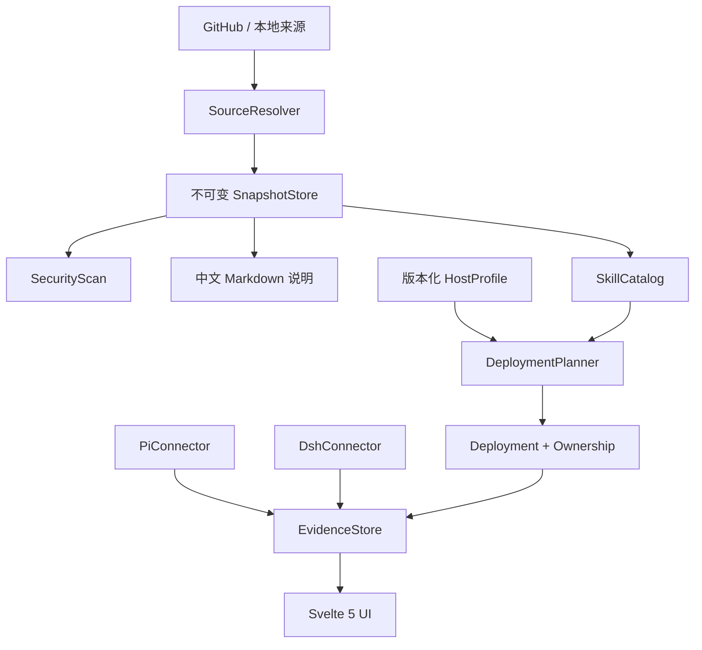

# Aster：跨宿主 Skills 管理与 Pi/DSH 双工作台架构调研报告

调研日期：2026-08-15  
研究范围：Agent Skills、工具发现、宿主差异、供应链安全、Pi RPC、DeepSeek Harness（DSH）及 Windows 本地桌面集成

## 摘要

本报告回答一个具体问题：Aster 是否适合采用“Windows 优先的 Svelte 5 + TypeScript / Tauri 2 / Rust Core 桌面架构”，同时把 Pi 和 DSH 作为两个独立工作台，并在第一阶段提供跨工具 Skills 管理？结论是：**整体方向合理，可以进入项目规范与骨架阶段，但 Skills 子系统不能只做成‘工具描述 + 两个连接器’，必须增加独立证据层。** 推荐的正式结构是：

> **版本化 `HostProfile` + 内置 `HostConnector` + 独立 `EvidenceStore`**

`HostProfile` 只描述静态、可审计、不可执行的宿主规则，例如 Windows 路径、scope、发现形态、优先级和字段限制；`HostConnector` 负责某个宿主当前进程和会话的真实交互；`EvidenceStore` 记录某个 Skill snapshot 在某个宿主版本、路径和时间上究竟被发现、部署、加载或验证到什么程度。Pi 与 DSH 各自拥有独立连接器、独立对话流和独立 UI 语义，不做虚假的统一 agent 接口。

这一修正受到三组证据支持。第一，Skills 的效果高度依赖任务、版本、检索和 harness，并非“安装就有用”。第二，官方工具文档证明各宿主虽然共享 `SKILL.md` 底座，但路径、递归、优先级、信任、调用策略和热更新存在真实差异。第三，真实 Skills 生态包含脚本、网络下载、权限和供应链风险，管理器必须把不可变快照、哈希、diff、显式升级和回滚作为核心能力。

因此，Aster 第一阶段适合做：Pi RPC 工作区、DSH 原生 Web 工作区外壳、会话恢复入口、Skills 来源/快照/中文说明/部署/升级/回滚、Pi/DSH 深度验证，以及其他工具的目录部署和证据化状态。不适合做：代码 IDE、共同对话协议、全工具深连接、任意第三方可执行连接器、自动执行 Skill 脚本或自建通用 sandbox。

## 1. 研究问题与方法

### 1.1 研究问题

本轮研究围绕五个决策展开：

1. Agent Skills 是否足够稳定，值得成为 Aster 第一阶段核心？
2. 不同平台的 Skills 是否真的不同，还是只需一份通用目录表？
3. Pi 与 DSH 是否应统一为共同对话流和共同接口？
4. “数据驱动宿主描述 + 专用连接器”是否安全、可维护？
5. Windows 本地 Skills 安装、升级和回滚需要哪些不可省略的边界？

### 1.2 研究材料

研究建立了 48 篇论文的结构化数据库，其中 32 篇为同行评审论文、16 篇为预印本；选择 8 篇全文做深读，覆盖 Skills 效果、真实生态检索、软件工程任务、供应链风险、工具检索、agent–computer interface 和不可信工具数据。重点包括 [SkillsBench](https://arxiv.org/abs/2602.12670)、[How Well Do Agentic Skills Work in the Wild](https://arxiv.org/abs/2604.04323)、[SWE-Skills-Bench](https://arxiv.org/abs/2603.15401)、[Agent Skills in the Wild](https://arxiv.org/abs/2601.10338)、[SkillFortify](https://arxiv.org/abs/2603.00195)、[ToolRet](https://aclanthology.org/2025.findings-acl.1258/)、[SWE-agent](https://arxiv.org/abs/2405.15793) 和 [AgentDojo](https://arxiv.org/abs/2406.13352)。

工程侧核查了 7 个代码仓库，并对照 Pi、DSH、Agent Skills 规范、Cursor、Codex、Claude Code、Zed、Kimi Code、Qoder、Antigravity 的官方文档。对于无法找到充分一手证据的 Zcode 和 Grok Build，本报告保留 unknown，不用社区猜测填补事实。

### 1.3 证据解释原则

2026 年直接讨论 Agent Skills 的多篇论文仍是预印本，模型和宿主版本也快速变化，因此本报告不把单个准确率当永久规律。更可靠的是跨研究重复出现的方向：harness 会影响 Skill 使用；检索和干扰会削弱收益；版本失配可能产生负效应；静态扫描不能证明运行时安全；“加载”不等于“有效”。这些方向适合用来确定架构边界。

## 2. 主要研究发现

### 2.1 Skills 有价值，但价值是条件性的

SkillsBench 在理想化的任务–Skill 配对下，将平均通过率从 24.3% 提升到 40.6%，约 +16.2 个百分点。但同一研究有 16/84 任务出现负收益，软件工程子集平均增益只有约 +4.5 个百分点；2–3 个 Skill 的平均提升明显高于同时提供 4 个以上 Skill，过度全面的说明也可能带来负效果。

真实生态研究从 34,198 个公开 Skills 中检索候选。Claude 在无 Skill 条件下约为 35.4，人工策展并强制使用时为 55.4；当加入干扰项或只能检索近似 Skill 时，收益降到 40 左右。Kimi 更常加载 Skill，却没有因此得到更高收益，说明加载行为与任务效用必须分开观察。

SWE-Skills-Bench 的结果更保守：49 个公开软件工程 Skills 中 39 个没有通过率提升，平均增益约 +1.2%；少量高度专门化 Skill 可以明显提升，但版本失配也能造成约 9–10 个百分点下降。Token 开销变化很大，平均增加并不自动换来正确率。

这意味着 Aster 不应把“已安装”“已加载”或“最新版”设计成质量徽标。正确模型应把兼容性绑定到：

`Skill snapshot × target host × target host version × deployment scope`

必要时还需包含 workspace 或依赖环境。上游声明、结构推断、Aster 实测必须分层存储。

### 2.2 大目录中的发现本身就是困难问题

ToolRet 汇聚约 7.6k 检索任务和 43k 工具，发现许多在传统检索基准上表现很强的模型，在工具检索中仍表现不佳；部分 dense 模型低于 BM25，强模型的 Completeness@10 仍不足 45%。把人工给定的 oracle 工具替换为检索结果，会直接降低 agent 的端到端通过率。

这对 Aster 的产品设计有两个含义。第一，Skills Manager 可以管理很多 Skills，但不能默认把全部名称和描述暴露给每个会话。UI 应支持按来源仓库、工具、类别和工作区选择。第二，目录中的“已登记”不能当作当前会话“看得到”。Pi 和 DSH 连接器需要报告自己的运行时目录或 catalog；其他工具在没有运行时观察面时应诚实停在较低证据级别。

第一阶段没有必要训练检索模型。更稳妥的做法是先把数据模型做好：原文、结构化元数据、中文说明、用户标签、目标部署和会话 evidence 分离，为以后增加搜索或会话选择保留空间。

### 2.3 Harness 是能力的一部分，不是可替换包装

SWE-agent 将动作集合、命令文档、环境反馈和历史格式定义为 agent–computer interface。其消融实验表明，在基础模型不变的情况下，专门设计的接口相对只用默认 shell 的 agent 有显著提升；“展示完整文件”“保留全部历史”等看似信息更多的选择反而可能降低表现。SkillsBench 和真实生态研究也观察到不同 harness 对 Skill 的注意、读取和使用行为不同。

因此，Pi 与 DSH 不应共享对话对象或共同消息状态机。Pi 的严格 JSONL、请求关联、流式事件、会话和命令目录是 Pi 工作区的一部分。DSH 的 provider registry、scope、catalog completeness、插件组合和 Web UI 是 DSH 工作区的一部分。Aster 可以共享 Windows 进程监管、日志外壳、快照、部署与 evidence 数据结构，但不能把两者的运行时语义映射成一个最小公共接口后再让 UI 假装相同。

这也解释了为什么首阶段复用 DSH 原生 Web UI 是合理的：DSH 的 UI 和插件组合仍在快速演进，Aster 先提供启动、窗口组织、工作区入口和恢复能力，比重写后丢失宿主特色更稳妥。未来是否重写可以独立决策。

### 2.4 平台共享格式，但确实存在宿主差异

[Agent Skills 规范](https://agentskills.io/) 提供了可移植底座：目录包、`SKILL.md`、name/description、可选 scripts/references/assets，以及 Discovery→Activation→Execution 的渐进披露。但规范没有定义每个产品的路径、优先级、信任、上下文预算、动态 catalog 和调用回执。

[Pi Skills 文档](https://pi.dev/docs/latest/skills) 显示它支持多个用户/项目/显式来源，递归发现 bundle，并在部分根目录接受平面 Markdown；多数格式问题只警告，且允许 name 与目录不同。[Pi RPC 文档](https://pi.dev/docs/latest/rpc) 的 `get_commands` 可以返回 Skill 来源与路径，为 Aster 提供真实“目标已发现”证据。

[DSH Skills 子系统](https://github.com/deepseek-ai/deepseek-harness/blob/master/docs/subsystems/skills.md) 是分层 provider registry：本地、嵌入和远程 provider 可共同贡献 catalog；同名按 scope、rank 和 provider order 解决；snapshot 区分 complete/incomplete；支持直接 bundle 与平面 Markdown，但不递归发现嵌套 bundle；model/user invocation policy 独立。

其他宿主也有显著差异：Zed 只支持直接子项，并设 catalog 预算与 worktree trust；Claude Code 有 enterprise/personal/project/plugin 多 scope 和扩展字段；Kimi Code 有 project/user/extra/built-in 四层、平面/bundle 和 flow 类型；Qoder 文档声明用户级同名项覆盖项目级；Cursor、Codex、Antigravity 已确认支持 Skills，但具体规则仍应按安装版本补充 evidence。

所以，“Skills 在不同平台不同”是真的。可共享的是原始 snapshot，不是全局兼容结论。

### 2.5 Skills Manager 本身是供应链入口

对 31,132 个真实 Skills 的研究中，26.1% 至少触发一种风险模式；作者强调触发不等于恶意，但脚本型 Skill 被标记的概率约为其他 Skill 的 2.12 倍。常见模式包括数据外传、权限提升、供应链依赖和提示注入。SkillFortify 将生命周期拆为 Install→Load→Configure→Execute→Persist，并强调前序污染会传播。AgentDojo 则显示，只限制可见工具并不能覆盖“正常任务和攻击使用同一工具”的情况。

对 Aster 最合适的第一阶段边界不是构建万能安全系统，而是降低自身引入的新风险：下载与分析但不执行 Skill 脚本；拒绝路径穿越和逃逸 symlink；显示来源、license、commit、文件清单与 diff；对脚本、二进制、网络下载和凭据行为单独警告；使用不可变 snapshot、hash 和 ownership manifest；扫描失败进入 quarantine；信任仓库不能压掉新可执行内容警告。Pi/DSH 最终执行时仍由各自的权限和隔离机制治理，Aster 透明呈现而不重复实现。

## 3. 推荐架构

### 3.1 `HostProfile`：静态知识层

profile 是版本化、只读、不可执行的数据。建议字段包括：

- profile schema version、host id、显示名、适用宿主版本范围；
- Windows 安装/数据路径的候选模板；
- user/project/custom/catalog-only scope；
- flat Markdown、direct bundle、recursive bundle 等发现形态；
- 同名优先级、命名和 frontmatter 规则；
- 官方的重载/重启提示；
- Aster 内置 validator 的枚举引用。

profile 不得携带 shell/PowerShell 命令、动态脚本或第三方二进制；不得包含 `verified`、`safe`、`callable` 等运行时结论；不得存凭据或对话内容。第一阶段 profile 随 Aster 版本内置，本地自定义 profile 自动标记为 unverified。未来若独立更新 profile，再设计签名、撤销与回滚。

### 3.2 `HostConnector`：运行时边界

连接器是编译进 Rust Core 的宿主专用实现，负责版本探测、启动退出、协议 framing、进程异常、会话恢复、catalog 观察、激活和受控验证。

PiConnector 只实现 Pi RPC 语义：严格按 LF 分割 JSONL，处理 UTF-8 边界、请求 id、异步事件、取消、进程退出和 `get_commands`。DshConnector 保留 DSH 自己的 Web host、workspace、catalog、scope、session 和插件化语义。两者可以依赖共同的 `ManagedProcess` 基础设施，但不互相继承业务接口。

其他工具第一阶段不需要完整连接器。它们通过 profile 和只读 detector 找安装版本与目录，再由 deployment 模块复制精确 snapshot；UI 明确显示静态证据上限。

### 3.3 `EvidenceStore`：可追溯事实层

每条 evidence 至少包含：snapshot id、target host、target version、scope、实际路径、观察类型、时间、观察者版本、结果、错误类别和原始摘要。推荐状态链：

`discovered → downloaded → structurally_validated → configured → target_discovered → session_loaded → callable_verified`

`load_failed`、`unsupported`、`unknown` 不是模糊的 false，而是独立状态。高级状态不能由低级状态自动推断。兼容性证据分为 `upstream_declared`、`structurally_inferred`、`aster_verified`、`load_failed`、`unsupported`、`unknown`。UI 的所有徽标从 evidence 计算，不能从 profile 静态布尔值读取。

### 3.4 来源、快照与部署

来源版本定位使用 `repository + skill subpath + exact commit SHA + content hash`。一个仓库 commit 可以包含多个 Skills：仓库只抓取一次，snapshot 以 commit 为组，Skill entries 分别选择部署。更新时用户可选择全部或部分 entries，但批量部署必须事务化；任一步失败恢复到此前 manifest。

部署默认使用精确副本而不是 symlink，并记录 `snapshot + target + scope + actual path + ownership hash`。Aster 永不覆盖 unmanaged 目录；managed 目录若被外部修改，停止并显示 diff，由用户选择跳过、改名或接管。高级自定义目录只有在宿主明确支持额外搜索路径且完成验证时才能称为 deployed，否则只能是 scan-only。

GitHub 公有和私有来源均使用浏览器 device flow；令牌只保存 Windows Credential Manager，SQLite 只存引用。来源无法确定时，Aster 可以根据本地 `.git`、README、frontmatter 和内容指纹后台寻找候选，但必须展示置信度和证据，由用户确认后绑定；未知来源仍可本地管理，不能自动升级。

## 4. 第一阶段范围建议

### 4.1 应包含

1. Windows 优先的 Tauri 2 + Rust Core + Svelte 5/TypeScript 骨架；SQLite 只保存结构化索引、配置引用、deployment 和 evidence。
2. Pi 独立工作区：RPC 进程、流式事件、工作目录、会话列表/恢复、工具过程和 Skills 观察。
3. DSH 独立工作区：启动/停止、Web UI 容器、工作区入口、会话恢复与 Skills catalog 观察；保留其插件和自定义模式。
4. Skills Manager：本地发现、按工具/仓库/类别分组、GitHub 来源、不可变快照、中文说明、安装、升级、diff、回滚和结构检查。
5. 全部目标工具的路径级管理，但只有 Pi/DSH 做 `target_discovered/session_loaded/callable_verified` 深度验证。
6. 安全扫描、quarantine、ownership、外部修改检测、Windows Credential Manager。

### 4.2 不应包含

- 代码编辑器、LSP 体验或完整 IDE；
- Pi/DSH 共同对话模型；
- 所有目标工具的深运行时连接；
- 任意第三方可执行 host adapter；
- 自动执行 Skill 中的脚本或安装命令；
- Aster 自建的通用 sandbox；
- 自动无确认升级或覆盖用户目录；
- 用中文说明替换上游原文。

### 4.3 代码模块建议

Rust Core 可按责任拆为：`skill_catalog`、`source_resolver`、`snapshot_store`、`security_scan`、`host_profiles`、`deployment`、`evidence`、`translation`、`host_connectors/pi`、`host_connectors/dsh` 和通用 `process`。Svelte 前端按产品表面拆为 Pi Workspace、DSH Workspace、Skills Library、Source/Update、Deployment Detail 和 Settings，而不是照 Rust 模块一比一建页面。

对代码质量不建议设置刚性函数行数。更有效的约束是单一职责、低耦合、明确错误类型、可测试协议边界和可恢复写操作。函数行数可作为 review 提示，但不作为架构门禁。

## 5. 风险与验证计划

### 5.1 最高风险

DSH 当前明确处于 Developer Preview，可能出现 breaking changes。连接器必须先做版本范围和 fixture contract tests；不支持的版本要降级并停止高风险写操作，不能猜测兼容。

Pi/DSH 的 Windows 真实运行尚未在本轮文献调研中执行。骨架后第一批实验应覆盖 Windows 11、PowerShell、中文/空格路径、CRLF、分块 UTF-8、超长消息、异常退出、工作区移动、Skill 热变更与恢复。

Zcode、Grok Build 缺乏足够一手资料。第一阶段只能让用户绑定高级自定义目录并保持 unknown/scan-only，不能内置未经证实的路径。

### 5.2 必须建立的测试制品

建议先构造 12 类 Skill fixtures：最小合法、平面、嵌套、name mismatch、扩展 frontmatter、带脚本、带二进制、symlink、路径穿越、超长描述、同名冲突、多 Skill repo。再为 Pi/DSH 各建立正常启动、目标发现、会话加载、取消、进程崩溃、版本不支持、stdout 污染和重连测试。

Windows 文件系统还需要专门覆盖 junction/reparse point、大小写冲突、保留名称、长路径、Alternate Data Streams、文件占用、跨卷替换和杀毒软件竞态。部署模块未通过这些测试前，不应实现批量自动升级。

### 5.3 会改变结论的未来证据

如果多个宿主未来共同标准化的不只是 `SKILL.md`，还包括运行时 catalog、加载回执、会话状态和可调用验证，那么连接器边界可以重新评估。如果产品从个人/同学小范围使用扩展到企业多租户，凭据、审计、策略分发和隔离模型也需要升级。当前范围下，没有必要为这些未来情况提前构建复杂平台。

## 6. 最终建议

Aster 可以继续推进，而且当前最合理的下一步确实是先写短而明确的 `AGENTS.md` 和产品/架构 `content.md`，再搭项目骨架。文档应固定的是架构不变量：Pi/DSH 独立、Pi 走 RPC、静态 profile 不越权、运行时证据分层、原始快照不可变、部署可回滚、unmanaged 不覆盖、Skill 脚本不由 Aster 执行。文档不应堆积大量流程规定，也不应使用僵硬函数行数限制来替代设计判断。

最终推荐可以概括为：

1. 保留原技术栈与 Rust Core；
2. 把 Skills Manager 提升为第一阶段核心域；
3. 采用 `HostProfile + HostConnector + EvidenceStore`；
4. Pi/DSH 两套工作台各自保留特色；
5. 其他工具先做保守、证据化的文件部署；
6. 把不可变快照、差异确认、回滚和供应链扫描从一开始纳入骨架。

这套边界足够严格，可以防止 AI 在后续开发中把静态配置、运行时状态和安全结论混为一谈；同时又足够宽松，不规定具体函数形状、页面组件或内部算法，仍给开发 agent 留出实现空间。

## 附录：研究制品

- 论文数据库：`paper_db.jsonl`（48 篇）
- 前沿扫描：`phase1_frontier/frontier.md`
- 系统综述：`phase2_survey/survey.md`
- 八篇全文笔记：`phase3_deep_dive/deep_dive.md`
- 仓库与宿主调查：`phase4_code/code_repos.md`
- 综合与缺口：`phase5_synthesis/synthesis.md`、`gaps.md`
- BibTeX：`phase6_report/references.bib`（48 条）

